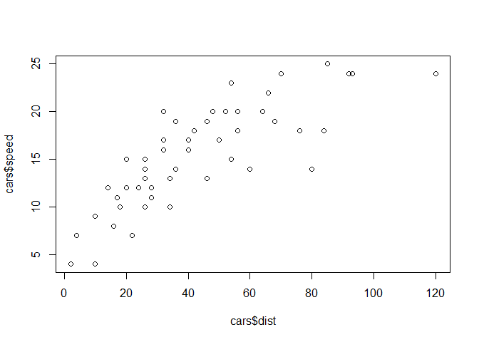
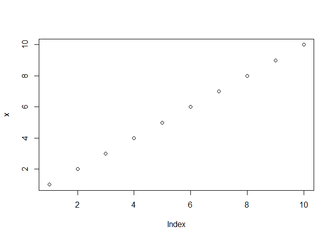

Stats\_Group\_Example
================
Patrick Daniele
December 3, 2018

Prepare for analyses
--------------------

``` r
set.seed(1234)
library(ggplot2)
library(lattice)
```

Basic console output
--------------------

To insert an R code chunk, you can type it manually or just press `Chunks - Insert chunks` or use the shortcut key. This will produce the following code chunk:

    ```r
    summary(cars)
    ```

    ```
    ##      speed           dist       
    ##  Min.   : 4.0   Min.   :  2.00  
    ##  1st Qu.:12.0   1st Qu.: 26.00  
    ##  Median :15.0   Median : 36.00  
    ##  Mean   :15.4   Mean   : 42.98  
    ##  3rd Qu.:19.0   3rd Qu.: 56.00  
    ##  Max.   :25.0   Max.   :120.00
    ```

    ```r
    plot(cars$dist,cars$speed)
    ```

    

LOOK AT MY PRETTY PLOT!!! IT IS **BEAUTIFUL!**

Now Moving on!
--------------

Pressing tab when inside the braces will bring up code chunk options.

The following R code chunk labelled `basicconsole` is as follows:

    ```r
    x <- 1:10
    y <- round(rnorm(10, x, 1), 2)
    df <- data.frame(x, y)
    df
    ```

    ```
    ##     x     y
    ## 1   1 -0.21
    ## 2   2  2.28
    ## 3   3  4.08
    ## 4   4  1.65
    ## 5   5  5.43
    ## 6   6  6.51
    ## 7   7  6.43
    ## 8   8  7.45
    ## 9   9  8.44
    ## 10 10  9.11
    ```

The code chunk input and output is then displayed as follows:

``` r
x <- 1:10
y <- round(rnorm(10, x, 1), 2)
df <- data.frame(x, y)
df
```

    ##     x     y
    ## 1   1  0.52
    ## 2   2  1.00
    ## 3   3  2.22
    ## 4   4  4.06
    ## 5   5  5.96
    ## 6   6  5.89
    ## 7   7  6.49
    ## 8   8  7.09
    ## 9   9  8.16
    ## 10 10 12.42

Plots
-----

Images generated by `knitr` are saved in a figures folder. However, they also appear to be represented in the HTML output using a [data URI scheme](http://en.wikipedia.org/wiki/Data_URI_scheme). This means that you can paste the HTML into a blog post or discussion forum and you don't have to worry about finding a place to store the images; they're embedded in the HTML.

### Simple plot

Here is a basic plot using base graphics:

    ```r
    plot(x)
    ```

    

``` r
plot(x)
```


